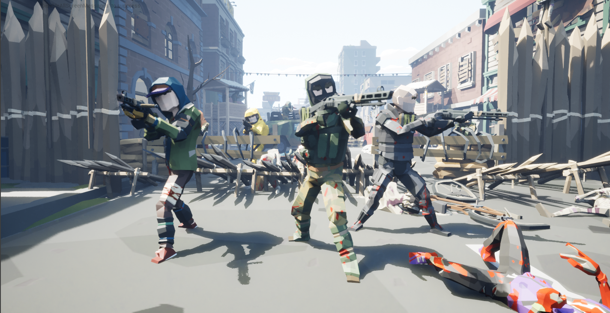

# Intro

Welcome to this apocalyptic world where your fight is about to begin. At the beginning of the great collapse, mysterious creatures and powers from a terrible world began to emerge in ours; shortly thereafter they wiped out everything we knew.&#x20;

Many were the lost battles and the soldiers who did not return. Someday everything will return to calm, and your help is necessary to reestablish that world we knew.

Many are the changes that you will find when you enlist in our combat ranks. First you will notice that your initial equipment will grant you specific skills that will help you have an advantage with each enemy, this equipment is exclusively yours and you will not be able to trade with it, but nevertheless depending on how you fight, you will be able to gain better weapons and very effective skills against non-humans in the form of NFTs.

Every day you will find a tournaments that will help you to be a better warrior and accumulate points to win daily prizes in the form of [ALTERBG ](token/token/)tokens or even some free NFT. You can also explore the world in search of new challenges or simply protecting the citadel from its attackers; the higher your performance in combat, the better your pay.

When you explore the world and have the fortune to discover some enemy military fortress, you can look for reinforcements to defeat them and conquer the territory, sometimes you can get rewards for your feat

To Battle Soldier!

