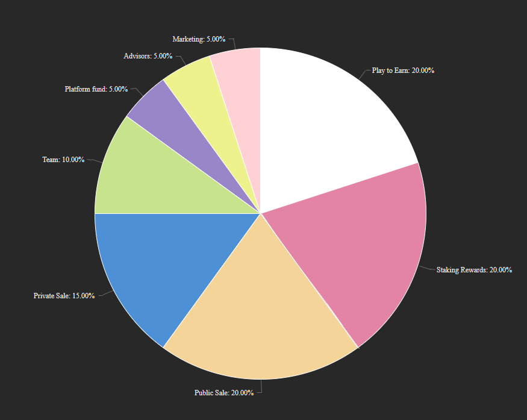

# Token

he Altered Battleground Token ($[AlterBg](https://bscscan.com/token/0xd343f58aCb66c23daBeadEA11F605165eDB4E5B0)) use ERC-20 / BEP-20 technology. Contract 0xd343f58aCb66c23daBeadEA11F605165eDB4E5B0

The AlterBg token distribution will be one hundred million tokens (100,000,000) that will be distributed over \~ five years.

This token is used as the main cryptocurrency / token within the entire Altered Battleground meta-verse. Every activity within the game will use this token as exchange currency with the exception of the store, which will use the BUSD stable coin.

All in-game purchases, manufacturing commissions and item repair commissions will be redistributed by 80% again among all players once the PlayToEarn base Stock limit is exhausted. With this we hope that the game will remain in force over time and the wealth of tokens generated will be shared among the players who gave us their trust over the years.

### Initial distribution of tokens

| Play to Earn                     | 20,000,000 | 20% |
| -------------------------------- | ---------- | --- |
| Staking Rewards                  | 30.000.000 | 25% |
| Platform fund                    | 5.000.000  | 5%  |
| Team (4 year lock up period)     | 10.000.000 | 10% |
| Advisors (5 year lock up period) | 5.000.000  | 5%  |
| Private Sale                     | 5.000.000  | 5%  |
| Public Sale                      | 25.000.000 | 25% |
| Marketing                        | 5.000.000  | 5%  |
